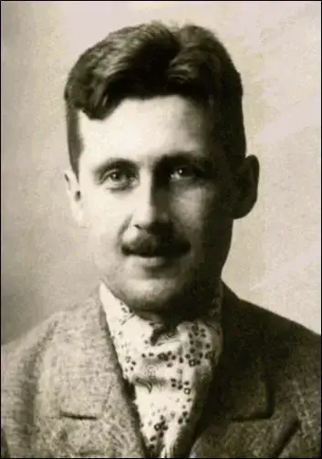
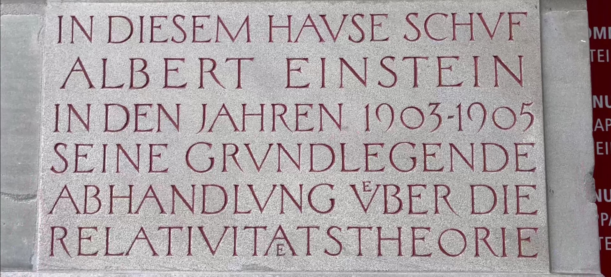
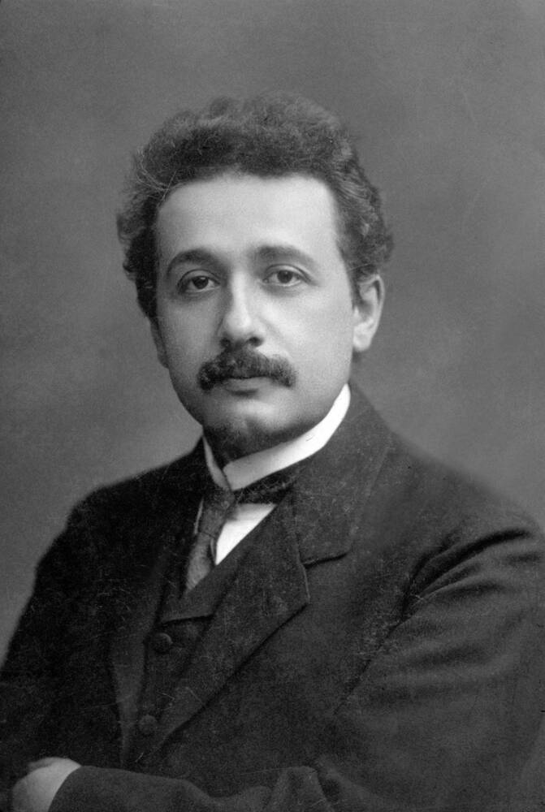

<!-- _class: titlepage -->

#     Nineteen Eighty-Four
##    General and Special Relativity in Physics
###   George Orwell <small>(Eric Arthur Blair)</small>
####  Bern, Schweiz, 1905
##### Eidgenössisches Amt für Geistiges Eigentum

---


---



---

# Normal Slide

Common texts

---

# Lists

<div class="columns">
<div>
      
<!-- _class: cool-list -->

1. _London_
2. _Manchester_
3. _Birmingham_
4. _Glasgow_
5. _Liverpool_

</div>  
<div>    
        
6. *Newcastle* 
7. *Sheffield*
8. *Nottingham*
9. *Southampton* 
10. *Edinburgh*

</div> 
</div>           
            
---


# Is Algebraic Graph Knowledge **Possible**?
 
Research has been conducted in order to evaluate the possibility of reaching meaningful knowledge from Algebraic Graph transformations.   
     
- Model Cheking and theorem prooving are viable paths. 

When the neet to  make strong assertions becomes inevitable:
- This is the first way: **outstanding assertion**!   
- Greater impact comes from: _hilight text_!  
- Even greater impact comes from: `hilight text`!  
   
> ***Note**: This is a very long footnote line intended to test the layout of two. 
> 
---         

<div class="columns">            
<div> 
 
# H1
## H2 
### H3 
#### H4
##### H5
###### H6
</div>
<div>
 
- This is a fragment o normal text written here in order to exemplify the use of several featrues in CSS.
 
- This is a fragment o normal text written here in order to exemplify the use of several featrues in CSS.

  - This is one **feature**
  - This is another subjetc.
 
</div>
</div>

---
 
# Lists

<div class="columns">
<div>
   
1. One
2. Two 
3. Three
   1. abc
   2. def
4. End of list

</div> 
<div> 

```haskell 

primes = filterPrime [2..]
  where filterPrime (p:xs) =
          p : filterPrime [x | x <- xs, x `mod` p /= 0]

seqLength :: Num b ⇒ Sequence a → b
seqAppend :: Sequence a → Sequence a → Sequence a

seqLength Nil = 0
seqLength (Cons _ xs) = 1 + seqLength xs

seqAppend Nil ys = ys
seqAppend (Cons x xs) ys = Cons x (seqAppend xs ys)    
     
```
<figcaption align="center">
<b>Code</b>: Haskell code fragment.
</figcaption>

</div>
</div>
 
---

# Tables  

| Column A | Column B | Column C | Column D |
| -------- | -------- | -------- | :------: |
| A1       | B1       | C1       |    D1    |
| A2       | B2       | C2       |    D2    |
| A3       | B3       | C3       |    D3    |

<figcaption align="center">
<b>Table</b>: Exemple of use of tables.
</figcaption>

---


# LaTeX Equations

$$\frac{1}{c^2}\frac{\partial^2\mathbf{\psi}}{\partial t^2} = \nabla^2 \circ\mathbf{\psi} $$
$$\nabla \times \textbf{E}=- \frac{\partial \textbf{B}}{\partial t}$$
$$\nabla^2 \textbf{E} = \mu \epsilon \frac{\partial^2 \textbf{E}}{\partial t^2}$$
$$c=\sqrt{\frac{1}{\mu \epsilon}}$$

<figcaption align="center">
<b>Formulae</b>: Exemples of use of LaTeX formulas.
</figcaption>

--- 

# Images in Two Columns

<div class="columns-center">
<div>         
 

<figcaption>
&nbsp
</figcaption>
   
</div> 
<div>


<figcaption>
&nbsp
</figcaption>

</div>
</div>

---

# Images in Two Columns

<div class="columns-center" align="center">
<div>         
 

<figcaption>
<b>Figure 1</b>: Göthe, Suhrkamp (2011).
</figcaption>
   
</div>
<div>


<figcaption>
<b>Figure 2</b>: Sophokles, Suhrkamp (2015).
</figcaption>

</div>
</div>

---

# Image and text

<div class="columns">
<div>

<center>


<figcaption align="center">
<b>Figure</b>: Oxford edition (1979).
</figcaption>


</center>

</div>
<div>

## Hegel's Phenomenology  
 
The book was originally entitled "Phänomenologie des Geistes" by its author, G.W.F. Hegel.

* Published in 1807, marked a significant development in German idealism after Kant.

* In this book Hegel develops his concepts of dialectic.

[Price at Amazon](https://www.amazon.com/gp/product/0198245971/ref=ox_sc_act_image_2?smid=A1ZZFT5FULY4LN&psc=1): $ 17.83

</div>
</div>
     
--- 

# Image and text

<div class="columns">
<div>


## Kant, Leibniz & Newton
 
Philosophy and the sciences were closely linked in the age of Leibniz, Newton, and Kant. 

This addresses the transformations of metaphysics as a discipline, the emergence of analytical mechanics, the diverging avenues of 18th-century Newtonianism, the body-mind problem, and philosophical principles of classification in the life sciences.


[Price at Amazon](https://www.amazon.de/Between-Leibniz-Newton-Kant-Philosophy/dp/3031343395/ref=sr_1_1?__mk_pt_BR=%C3%85M%C3%85%C5%BD%C3%95%C3%91&crid=16F5PCQR437M7&keywords=Kant+Springer&qid=1689169670&s=books&sprefix=kant+springer%2Cstripbooks%2C204&sr=1-1): 128,39 €


</div>
<div>
<center>


<figcaption align="center">
<b>Figure</b>: Springer edition (2023).
</figcaption>

</center>

</div>
</div>
     
--- 
 <!-- _class: cite -->        


"There is an **increasing** demand of current information systems to incorporate the use of a higher degree of formalism in the development process. **Formal Methods** consist of a set of tools and techniques based on mathematical model and formal logic that are used to **specify and verify** requirements and designs for hardware and software systems."

--- 
  
<!-- _class: cite -->


 
<div class="cite-author" data-text="Mona Batra">

   "There is an **increasing** demand of current information systems to incorporate the use of a higher degree of formalism in the development process. **Formal Methods** consist of a set of tools and techniques based on mathematical model and formal logic that are used to **specify and verify** requirements and designs for hardware and software systems."

</div>
     
---
<!-- _class: transition -->  



 Transition Slide 1<br> _Aditional_ **Text**
    
---         
<!-- _class: transition2 -->  


 Transition Slide 2<br> _Aditional_ **Text**
    
---   
<!-- _class: transition2 -->  

THANK YOU!


---

<!-- _class: biblio -->  


 
# References       

1. PLATO. **Plato Republic**. Tradução: C. D. C. Reeve. Indianapolis, IN, USA: Hackett Publishing Company, 2004. 

1. PLATO. **Plato Republic**. Tradução: C. D. C. Reeve. Indianapolis, IN, USA: Hackett Publishing Company, 2004. 
2. ARISTOTELES. **Nikomachische Ethik**. Berlin: Akademie Verlag, 2010. (Klassiker Auslegen).v. 2
3. KANT, Immanuel. **Kritik der Praktischen Vernunft**. Berlin: Akademie Verlag, 2002. (Klassiker Auslegen).v. 26 
4. HEGEL, Georg Friederich Wilhelm. **Hegel´s Phenomenology of Spirit**. Tradução: A. V. Miller. New York: Oxford University Press, 2004.

--- 

<!-- _class: biblio -->

# References 
<div class="columns">
<div>

1. PLATO. **Plato Republic**. Tradução: C. D. C. Reeve. Indianapolis, IN, USA: Hackett Publishing Company, 2004. 
2. ARISTOTELES. **Nikomachische Ethik**. Berlin: Akademie Verlag, 2010. (Klassiker Auslegen).v. 2
3. KANT, Immanuel. **Kritik der Praktischen Vernunft**. Berlin: Akademie Verlag, 2002. (Klassiker Auslegen).v. 26 
4. HEGEL, Georg Friederich Wilhelm. **Hegel´s Phenomenology of Spirit**. Tradução: A. V. Miller. New York: Oxford University Press, 2004.

</div>
<div>

5. HUSSERL, Edmund. **The Crisis of European Sciences and Transcendental Phenomenology**. Evanston, USA: Northwestern University Press, 1970. 
6. CASSIRER, Ernst. **The Myth of the State**. New Haven, USA: Yale University Press, 1946.
7. HEIDEGGER, Martin. **Sein und Zeit**. 11. ed. Tübingen: Max Niemeyer Verlag, 1967. 
8. GADAMER, Hans-Georg. **Wahrheit und Methode**. Berlin: Akademie Verlag, 2007. v. 30.
</div>
 
